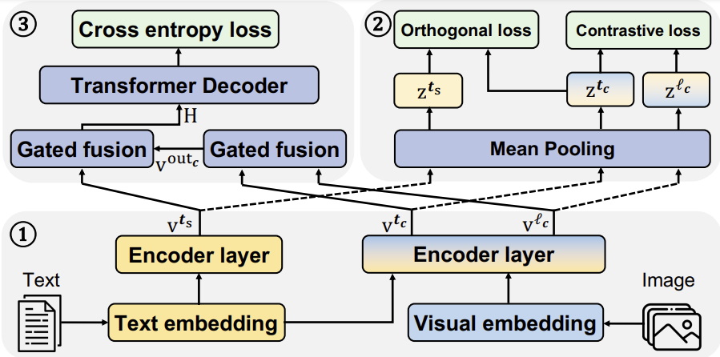

# MMT

This is the official implementation for the paper "FINE-LMT: Fine-grained Feature Learning for Multi-Modal Machine Translation" accepted by PRICAI2024. 

# Structure of FINE-LMT


## Requirement
- Python  3.9.17
- Pytorch 1.13.1
- Fairseq 0.12.2
The detailed environment configuration is provided in environments.yaml.

## File 
Because it is the first, fast version of our project, we hope you can put "FeatureAlignment.py" in "/fairseq/fairseq/models", "language_pair_dataset.py" in "/fairseq/fairseq/data", "orthogonalLoss.py" in "/fairseq/fairseq/modules" and "multimodal_translation.py" in "/fairseq/fairseq/tasks".
If you want to implement pre-trained language model-based FINE-LMT, please refer to [VGAMT](https://github.com/MatthieuFP/VGAMT) and replace the file "fine-lmt-plm.py" with "vgamt.py".

## Data
- The processed text data is provided in the data-bin file.
- Image feature can be obtained by using "imageFeatureExtraction.py". The original image data can be download at [Flickr](https://www.statmt.org/wmt17/multimodal-task.html) and [Multi30k](https://github.com/multi30k/dataset)

### Train the model
```
bash train.sh
```

### Evaluate the model
When evaluate the model, please use the correponding image index in the "language_pair_dataset.py" file.
```
CUDA_VISIBLE_DEVICES=0 python fairseq/fairseq_cli/generate.py \
fairseq/data-bin/multi30k_en_de/test2016 --task MultimodalT --path fairseq/model/MMTSaved/123456.ensemble.pt --beam 5 --lenpen 1 --batch-size 128 --remove-bpe
CUDA_VISIBLE_DEVICES=0 python fairseq/fairseq_cli/generate.py \
fairseq/data-bin/multi30k_en_de/test2016 --task MultimodalT --scoring meteor --path fairseq/model/MMTSaved/123456.ensemble.pt --beam 5 --lenpen 1 --batch-size 128 --remove-bpe
```
## Citation
If this repository is useful for you, please cite as:
```
@InProceedings{10.1007/978-981-96-0119-6_32,
author="Wang, Yusong
and Zhang, Ying
and Li, Dongyuan
and Shen, Jialun
and Xu, Yicheng
and Xu, Mingkun
and Funakoshi, Kotaro
and Okumura, Manabu",
editor="Hadfi, Rafik
and Anthony, Patricia
and Sharma, Alok
and Ito, Takayuki
and Bai, Quan",
title="FINE-LMT: Fine-Grained Feature Learning for Multi-modal Machine Translation",
booktitle="PRICAI 2024: Trends in Artificial Intelligence",
year="2025",
publisher="Springer Nature Singapore",
address="Singapore",
pages="334--346",
}

```
